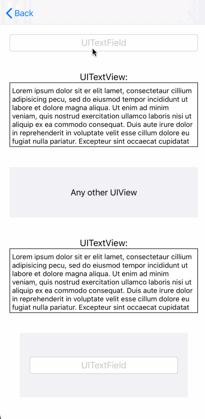

# ODScrollView
[](https://github.com/orcundeniz/ODScrollView/) [](https://developer.apple.com/swift/) [](https://cocoapods.org/pods/ODScrollView) [](https://github.com/Carthage/Carthage) [](https://github.com/orcundeniz/ODScrollView/blob/master/LICENSE)

ODScrollView is a framework that automatically moves editable text areas like UITextField and UITextView vertically depending on keyboard visibility to offer better user experience.
 
 ## Features
 * Automatically moves first responder UIViews that adopt the UITextInput protocol up/down when the keyboard appears/disappears, e.g., UITextField, UITextView, UISearchTextField or any custom UIView that adopts UITextInput protocol. 
     * Note that if UITextInput's frame does NOT fits the remaining area between ODScrollView and keyboard, then ODScrollView adjusts UITextInput based on cursor position instead of frame. In such cases, "trackTextInputCursor" feature can be used. [Example](https://github.com/orcundeniz/ODScrollView/blob/master/docs/GIFs/ExamplesForSettings.md#alwaysallbottomtrackcursor
)
 
 * Adjustment margin can be applied for each UITextInput seperately for .Top and .Bottom adjustment direction setting. 20 CGFloat by default.

 * Adjustment can be enabled/disabled for each UITextInput seperately. true by default.

 * Adjustment directon - .Top, .Center, .Bottom - can be applied for each UITextInput seperately. .Bottom by default. [Example](https://github.com/orcundeniz/ODScrollView/blob/master/docs/GIFs/ExamplesForSettings.md#alwaysbottomuitextviewsandcenteruitextfieldsandrest
)
  
 * Adjustment options determines how ODScrollView adjusts. .Always by default.
     * .Always : ODScrollView always adjusts the UITextInput which is placed anywhere in the ODScrollView regardless UITextInput overlaps or not with shown keyboard. [Example](https://github.com/orcundeniz/ODScrollView/blob/master/docs/GIFs/ExamplesForSettings.md#alwaysallbottom
)
     * .IfNeeded : ODScrollView only adjusts the UITextInput if it overlaps with the shown keyboard. [Example](https://github.com/orcundeniz/ODScrollView/blob/master/docs/GIFs/ExamplesForSettings.md#ifneededallcenter
)

 * Besides UIScrollView.keyboardDismissModes, the keyboard can be dismissed by tapping a UIView which is provided by ODScrollViewDelegate. After the keyboard is dismissed, ODScrollView can return its original position. nil and false by default. [Example](https://github.com/orcundeniz/ODScrollView/blob/master/docs/GIFs/ExamplesForSettings.md#alwaysallbottomtrackcursor
)
 
 ## Examples
<table>
  <tr>
    <td align="left">  </td>
    <td align="right"> 
     <p align="left">
         adjustmentMargin = 20 <br>
         adjustmentEnabled = true <br>
         adjustmentDirection = .Bottom for all UITextInputs <br>
         adjustmentOption = .Always <br>
         hideKeyboardByTappingToView = ViewController.view <br>
         isResettingAdjustmentEnabled = true <br>
         UIScrollView.keyboardDismissMode = .onDrag </p>
    </td>
  </tr>
</table>
 
 [Another Examples](https://github.com/orcundeniz/ODScrollView/blob/master/docs/GIFs/ExamplesForSettings.md)
 
  ## Requirements
  
 * iOS 12.0+
 * Xcode 10.2+
 * Swift 5+

  ## Installation

  ### CocoaPods
  
  Check out [Get Started ](https://guides.cocoapods.org/using/getting-started.html) tab on CocoaPods.

   To use ODScrollView in your project add the following 'Podfile' to your project

       use_frameworks!
       target 'MY_APP' do
         pod 'ODScrollView', '~> 0.1'
       end

   Then run:
        
       pod install
   
   ### Carthage
   
   Check out the [Carthage](https://github.com/Carthage/Carthage) docs on how to add a install. The ODScrollView framework is already setup with shared schemes.

   [Carthage Install](https://github.com/Carthage/Carthage#adding-frameworks-to-an-application)

   You can install Carthage with [Homebrew](https://brew.sh) using the following command:

        $ brew update
        $ brew install carthage
       
   To integrate ODScrollView into your Xcode project using Carthage, specify it in your Cartfile:
    
        github "orcundeniz/ODScrollView" >= 0.1
   
  ## Usage

 **1 -** First thing you need to do is setting up UIScrollView and its content view properly.
 
    - If you are using Content Layout Guide and Frame Layout Guide:
        1.1 - scrollView: Place UIScrollView anywhere you want to use.  
        1.2 - contentView: Place UIView inside scrollView.
        1.3 - Set contentView's top, bottom, leading and trailing constraints to Content Layout Guide's constraints.
        1.4 - Set contentView's width equal to Frame Layout Guide's width.
        1.5 - Set contentView's height equal to Frame Layout Guide's height or set static height which is larger than scrollView's height.
        1.6 - Build your UI inside contentView.
        
    - If you are NOT using Content Layout Guide and Frame Layout Guide:
        1.1 - scrollView: Place UIScrollView anywhere you want to use.  
        1.2 - contentView: Place UIView inside scrollView.
        1.3 - Set contentView's top, bottom, leading and trailing constraints to 0.
        1.4 - Set contentView's width equal to scrollView's width.
        1.5 - Set contentView's height equal to scrollView's superview's height or set static height which is larger than scrollView's height.
        1.6 - Build your UI inside contentView.
 
 **2 -** Change the scrollView's class from UIScrollView to ODScrollView in the identity inspector on Storyboard.
 
 **3 -** Create IBOutlets for scrollView and contentView on ViewController.
 
 **4 -** Call the following methods inside ViewDidLoad() on ViewController:
 
```swift
       override func viewDidLoad() {
           super.viewDidLoad()

           //ODScrollView setup
           scrollView.registerContentView(contentView)
           scrollView.odScrollViewDelegate = self
       }  
```

**5 -** Optional: You still can use UIScrollView's features:

```swift
       override func viewDidLoad() {
        super.viewDidLoad()
        
        //ODScrollView setup
        scrollView.registerContentView(contentView)
        scrollView.odScrollViewDelegate = self
        
        // UIScrollView setup
        scrollView.delegate = self // UIScrollView Delegate
        scrollView.keyboardDismissMode = .onDrag // UIScrollView keyboardDismissMode. Default is .none.
                
        UITextView_inside_contentView.delegate = self
       }
 ```
 
 **6 -** Adopt ODScrollViewDelegate from ViewController and decide ODScrollView options:

```swift
       extension ViewController: ODScrollViewDelegate {

           // MARK:- State Notifiers: are responsible for notifiying ViewController about what is going on while adjusting. You don't have to do anything if you don't need them.

           // Notifies when the keyboard showed.
           func keyboardDidShow(by scrollView: ODScrollView) {}

           // Notifies before the UIScrollView adjustment.
           func scrollAdjustmentWillBegin(by scrollView: ODScrollView) {}

           // Notifies after the UIScrollView adjustment.
           func scrollAdjustmentDidEnd(by scrollView: ODScrollView) {}

           // Notifies when the keyboard hid.
           func keyboardDidHide(by scrollView: ODScrollView) {}

           // MARK:- Adjustment Settings

           // Adjusts the distance between keyboard and firstResponder view.
           func adjustmentMargin(for textInput: UITextInput, inside scrollView: ODScrollView) -> CGFloat {
               if let textField = textInput as? UITextField, textField == self.UITextField_inside_contentView {
                   return 20
               } else {
                   return 40
               }
           }
           
           
           // Adjustment can be enabled/disabled for each UITextInput seperately.
           func adjustmentEnabled(for textInput: UITextInput, inside scrollView: ODScrollView) -> Bool {
               if let textField = textInput as? UITextField, textField == self.UITextField_inside_contentView {
                   return true
               } else {
                   return false
               }
           }


           //  Specifies adjustment direction for each UITextInput. It means that  some of UITextInputs inside ODScrollView can be adjusted to the bottom, while others can be adjusted to center or top.
           func adjustmentDirection(selected textInput: UITextInput, inside scrollView: ODScrollView) -> AdjustmentDirection {
               if let textField = textInput as? UITextField, textField == self.UITextField_inside_contentView {
                   return .Bottom
               } else {
                   return .Center
               }
           }

           /**
            - Always : ODScrollView always adjusts the UITextInput which is placed anywhere in the ODScrollView.
            - IfNeeded : ODScrollView only adjusts the UITextInput if it overlaps with the shown keyboard.
            */
           func adjustmentOption(for scrollView: ODScrollView) -> AdjustmentOption {
               .Always
           }

           // MARK: - Hiding Keyboard Settings

           /**
            Provides a view for tap gesture that hides keyboard.

            By default, keyboard can be dismissed by keyboardDismissMode of UIScrollView.

            keyboardDismissMode = .none
            keyboardDismissMode = .onDrag
            keyboardDismissMode = .interactive

            Beside above settings:

            - Returning UIView from this, lets you to hide the keyboard by tapping the UIView you provide, and also be able to use isResettingAdjustmentEnabled(for scrollView: ODScrollView) setting.

            - If you return nil instead of UIView object, It means that hiding the keyboard by tapping is disabled.
            */
           func hideKeyboardByTappingToView(for scrollView: ODScrollView) -> UIView? {
               self.view
           }

           /**
            Resets the scroll view offset - which is adjusted before - to beginning its position after keyboard hid by tapping to the provided UIView via hideKeyboardByTappingToView.

            ## IMPORTANT:
            This feature requires a UIView that is provided by hideKeyboardByTappingToView().
            */
           func isResettingAdjustmentEnabled(for scrollView: ODScrollView) -> Bool {
               true
           }
       }
```
 
 **7 -** Optional: You can adjust the ODScrollView when the cursor overlaps with keyboard while typing in multiline UITextInput. trackTextInputCursor(for UITextInput) must be called by UITextInput functions that is fired while typing.
 
 ```swift
         /**
         ## IMPORTANT:
         This feature is not going to work unless textView is subView of _ODScrollView
         */
         func textView(_ textView: UITextView, shouldChangeTextIn range: NSRange, replacementText text: String) -> Bool {
                 _ODScrollView.trackTextInputCursor(for textView)
                 return true
         }
```

