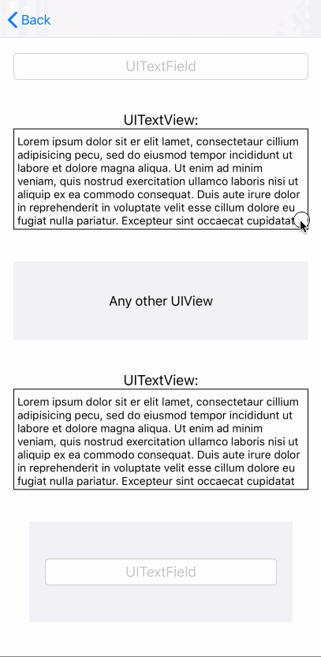
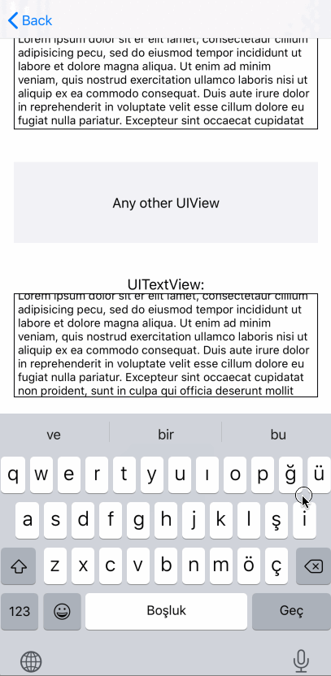
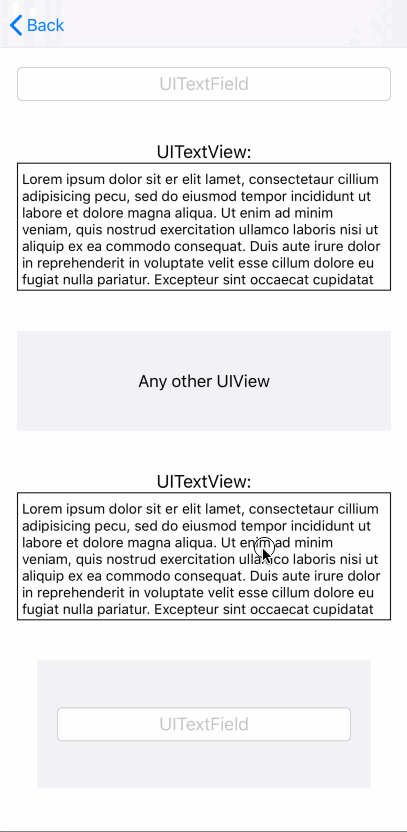
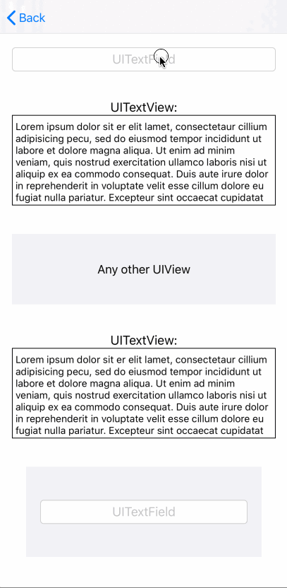
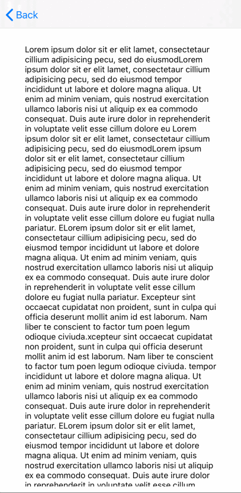

## You can find some UI examples for ODScrollView for some settings

### AlwaysAllBottom
<table width="300px" align="center">
  <tr>
    <td align="center">  </td>
  </tr>
   <tr>
      <td align="center" width="500px"> 
        

         adjustmentMargin = 20 for all UITextInputs 
         adjustmentEnabled = true for all UITextInputs 
         adjustmentDirection = .Bottom for all UITextInputs  
         adjustmentOption = .Always  
         hideKeyboardByTappingToView = ViewController.view  
         isResettingAdjustmentEnabled = true  
         UIScrollView.keyboardDismissMode = .onDrag 

    </td>
  </tr>
</table>
 
 
### AlwaysAllTopDisabledTapAndResetting
<table width="300px" align="center">
  <tr>
    <td align="center">  </td>
  </tr>
   <tr>
      <td align="center" width="500px">  
         

         adjustmentMargin = 20 for all UITextInputs 
         adjustmentEnabled = true for all UITextInputs 
         adjustmentDirection = <b><i>.Top for all UITextInputs</i></b>  
         adjustmentOption = .Always  
         hideKeyboardByTappingToView = <b><i>nil</i></b>  
         isResettingAdjustmentEnabled = <b><i>false</i></b>  
         UIScrollView.keyboardDismissMode = .onDrag 

    </td>
  </tr>
</table>
  
  
### AlwaysAllBottomDisabledResetting
<table width="300px" align="center">
  <tr>
    <td align="center">  </td>
  </tr>
   <tr>
      <td align="center" width="500px"> 
          

           adjustmentMargin = 20 for all UITextInputs 
           adjustmentEnabled = true for all UITextInputs 
           adjustmentDirection = <b><i>.Bottom for all UITextInputs</i></b> 
           adjustmentOption = .Always  
           hideKeyboardByTappingToView = <b><i>ViewController.view</i></b>  
           isResettingAdjustmentEnabled = false  
           UIScrollView.keyboardDismissMode = .onDrag 

    </td>
  </tr>
</table>

### AlwaysBottomUITextViewsAndCenterUITextFieldsAndRest
<table width="300px" align="center">
  <tr>
    <td align="center">  </td>
  </tr>
   <tr>
      <td align="center" width="500px"> 
         

             adjustmentMargin = 20 for all UITextInputs 
             adjustmentEnabled = true for all UITextInputs 
             adjustmentDirection = <b><i>.Bottom for UITextViews and .Center for UITextFields and rest</i></b>  
             adjustmentOption = .Always  
             hideKeyboardByTappingToView = ViewController.view  
             isResettingAdjustmentEnabled = <b><i>true</i></b>  
             UIScrollView.keyboardDismissMode = .onDrag 

    </td>
  </tr>
</table>

### IfNeededAllCenter
<table width="300px" align="center">
  <tr>
    <td align="center">  </td>
  </tr>
   <tr>
      <td align="center" width="500px"> 
         

             adjustmentMargin = 20 for all UITextInputs 
             adjustmentEnabled = true for all UITextInputs 
             adjustmentDirection = <b><i>.Center  for all UITextInputs</i></b>  
             adjustmentOption = <b><i>.IfNeeded</i></b>  
             hideKeyboardByTappingToView = ViewController.view  
             isResettingAdjustmentEnabled = true  
             UIScrollView.keyboardDismissMode = .onDrag 

    </td>
  </tr>
</table>
  
### AlwaysAllBottomTrackCursor
<table width="300px" align="center">
  <tr>
    <td align="center">  </td>
  </tr>
   <tr>
      <td align="center" width="500px"> 
         

             adjustmentMargin = 20 for all UITextInputs 
             adjustmentEnabled = true for all UITextInputs 
             adjustmentDirection = <b><i>.Bottom for all UITextInputs</i></b>  
             adjustmentOption = <b><i>.Always</i></b>  
             hideKeyboardByTappingToView = ViewController.view  
             isResettingAdjustmentEnabled = true  
             UIScrollView.keyboardDismissMode = .onDrag  
             <b><i>trackTextInputCursor</i></b> 

    </td>
  </tr>
</table>
